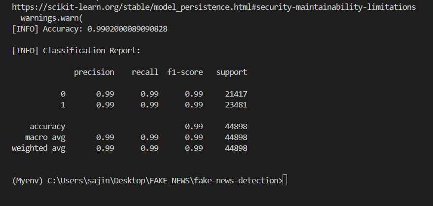
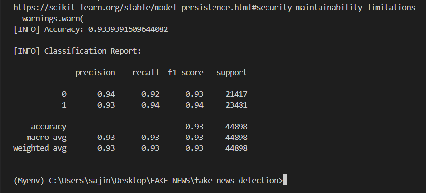
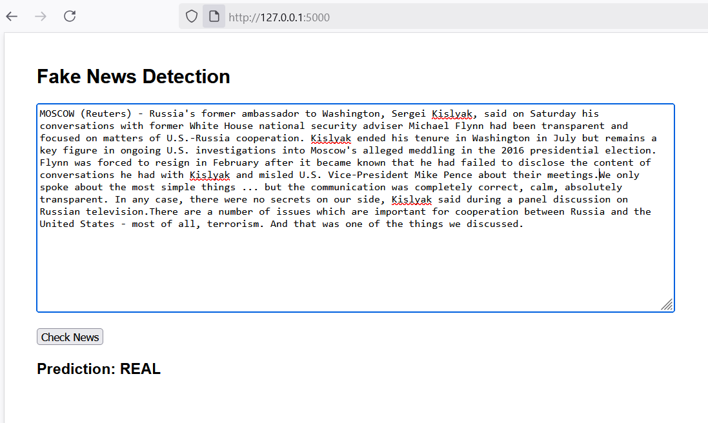
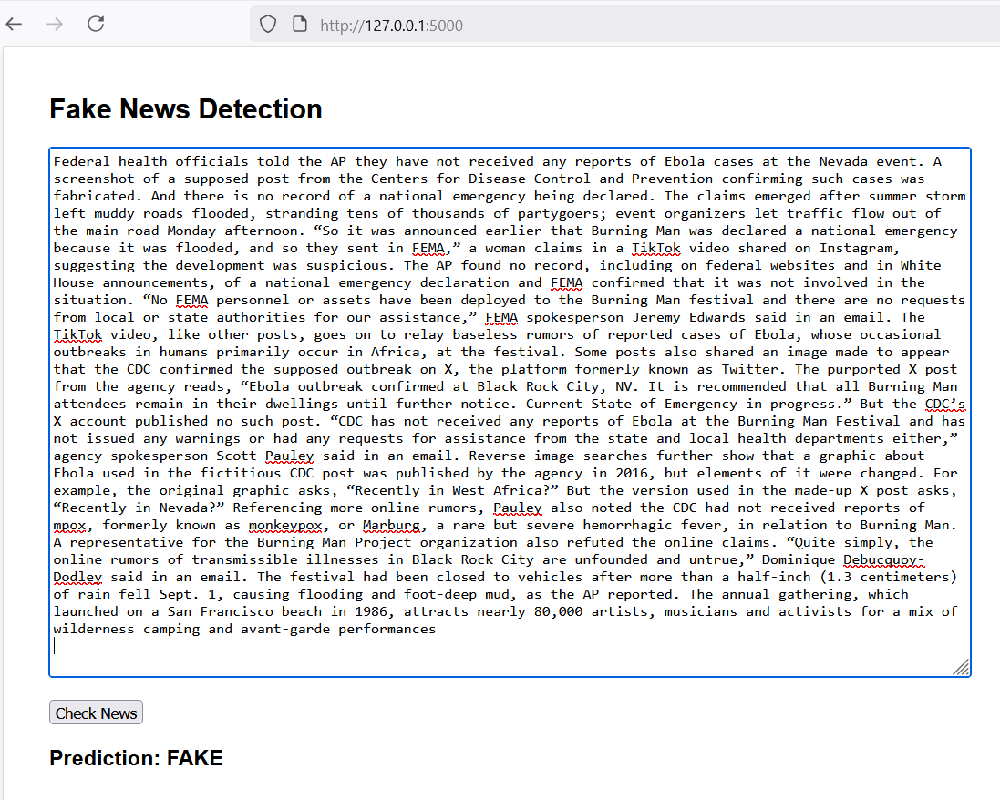

The project aims to develop a machine-learning model capable of identifying and classifying any news article as fake or not. The distribution of fake news can potentially have highly adverse effects on people and culture. This project involves building and training a model to classify news as fake news or not using a diverse dataset of news articles. I have used three techniques to determine the results of the model.

1. **Logistic Regression**
2. **Multinomial Naive Bayes**
3. **Random Forest Classifier**

## Project Overview:

Fake news has become a significant issue in today's digital age, where information spreads rapidly through various online platforms. This project leverages machine learning algorithms to automatically determine the authenticity of news articles, providing a valuable tool to combat misinformation.

## Dataset:

I have used a labelled dataset containing news articles along with their corresponding labels (true or false). The dataset is divided into two classes:
- True: Genuine news articles
- False: Fake or fabricated news articles

## System Requirements:

Hardware :
1. 8GB RAM
2. i5 Processor
3. 500MB free space

Software :
1. Python

## what this project accomplishes:

1. Load Fake.csv (labeled fake) and True.csv (labeled real).
2. Combine title + text columns to form a single input string.
3. Turn text into numerical features with TF-IDF.
4. Train 3 models (Logistic Regression, Random Forest, Naive Bayes).
5. Save models and vectorizer to models/.
6. Allow single-text prediction and batch prediction (manual tests), and show evaluation metrics.

## Project structure
fake-news-detection/
├─ data/
│  ├─ Fake.csv
│  ├─ True.csv
│  └─ manual_testing.csv   # optional
├─ models/                 # (created by training)
├─ src/
│  ├─ train.py             # trains all 3 models and saves them
│  ├─ predict.py           # CLI predict single text (uses saved vectorizer+model)
│  ├─ evaluate.py          # runs evaluation on dataset(s)
│  └─ app.py               # tiny Flask UI (uses logistic model by default)
├─ requirements.txt
└─ README.md

## Pipeline explanation:

1) Preprocessing (text cleaning)

- Lowercase everything.
- Remove URLs and non-alphanumeric characters.
- Collapse extra whitespace.
- Remove common English stopwords (using scikit-learn / built-in stop list).
- Why: reduces noise and vocabulary size so models learn from meaningful tokens.

2) Feature extraction — TF-IDF

- TF-IDF converts each document into a vector where each element represents a token or n-gram.
- We use ngram_range=(1,2) (unigrams + bigrams) because phrases often matter for fake news (“breaking news”, “sources say”).
- max_features limits vocabulary size (e.g., 5k–15k) to reduce memory and overfitting.
- Save the vectorizer (joblib) so predictions use the same mapping.

3) Models

# Logistic Regression

- Linear model, outputs probabilities.
- Fast, interpretable, often strong baseline for text classification.

# Random Forest

- Ensemble of decision trees — handles nonlinearity and feature interactions.
- Typically slower and heavier, but robust.

# Multinomial Naive Bayes

- Simple count-based model that often performs well on text data.
- Fast to train and cheap to predict.
- We train all three so you can compare metrics and choose which trade-off you want (speed vs accuracy vs interpretability).

4) Train/test split

- We split the combined dataset using train_test_split(..., stratify=y, test_size=0.15 or 0.2).
- Stratify ensures the class ratio (fake/real) is preserved in train and test.

## Project Screenshots

Classification_report: 
1) Logistic 

2) Random_forest  

3) Naive_bayes

Prediction results:
1) Real_news

2) Fake_news

## Usage:

Before running the code, make sure you have the following libraries and packages installed:

requirements.txt
    pandas
    numpy
    scikit-learn>=1.0
    joblib
    flask
    matplotlib

## How to run:

1) Create & activate venv and install:

    python -m venv venv                         # Windows (PowerShell)

    venv\Scripts\Activate.ps1                   # macOS/Linux

    source venv/bin/activate

    pip install -r requirements.txt

2) Train

    python src/train.py --fake data/Fake.csv --true data/True.csv --out models

    ## (When you run the training command, the script first loads and preprocesses your datasets (Fake.csv and True.csv), cleaning the text by removing unwanted symbols and preparing it for analysis. Next, it extracts features using TF-IDF, which converts the news articles into numerical vectors that machine learning models can understand. Finally, the script trains three different models (Logistic Regression, Random Forest, and Naive Bayes), evaluates them on a test set, and saves both the models and the vectorizer into the models/ folder for later use).

3) Prediction using Command Line Interface (CLI):

    python src/predict.py --text "Some news article text here" --model models/logistic_regression.joblib

    ## (When you run the prediction command, the script first loads the chosen saved model and the TF-IDF vectorizer from the models/ folder. It then transforms your input text (the sentence or news snippet you provide) into numerical form using the same vectorizer that was used during training. Finally, the model predicts whether the news is REAL or FAKE and prints the result directly in your terminal, allowing you to test any news article instantly.)

4) Evaluate a saved model against all data:

    python src/evaluate.py --model models/logistic_regression.joblib --fake data/Fake.csv --true data/True.csv

    ## (When you run the evaluation command, the script first reloads the dataset and the selected saved model from the models/ folder. Next, it runs predictions on the dataset to compare the model’s outputs with the actual labels (REAL or FAKE). Finally, it calculates detailed evaluation metrics such as accuracy, precision, recall, F1 score, and confusion matrix, giving you a clear picture of how well the model performs in detecting fake news.)

5) Run web app:

    python src/app.py

    # (When you start the Flask web app, the script first initializes the trained model and vectorizer so they are ready to process user inputs. Then, it launches a small web server that you can access through your browser at http://127.0.0.1:5000. Finally, the app provides a simple user interface where you can type or paste any news text, and the system will immediately classify it as REAL or FAKE and display the result on the page.)

## Future enhancements:

1) Preprocessing

- Add lemmatization (spaCy) or stemming (NLTK) to reduce morphological variants.
- Keep named entities and numbers (sometimes helpful).

2) Feature engineering

- Add features: article length, number of capitalized words, punctuation counts, presence of suspicious words (“shocking”, “exclusive”), source metadata.

3) Modeling

- Try ensembled predictions: combine Logistic Regression + Random Forest via voting.
- Try deep learning: use pretrained Transformer (BERT) or train an LSTM with embeddings — gives often better performance on nuanced text but requires more compute.

4) Handling imbalance

- If classes become imbalanced, use class_weight='balanced' (for LR/RF) or oversample minority (SMOTE) or undersample.

5) Deployment

- Containerize with Docker, or deploy the Flask app on Heroku / Railway / AWS Elastic Beanstalk.

